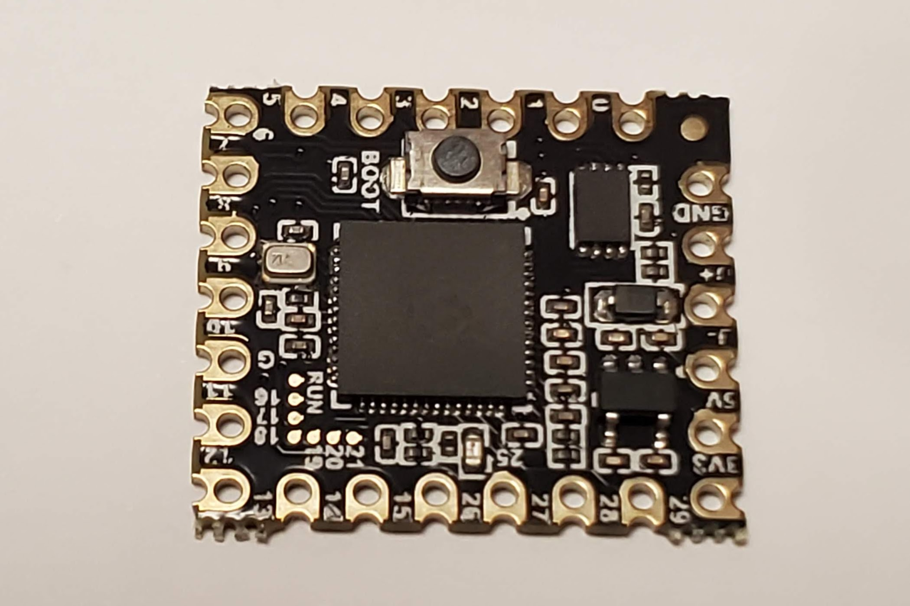
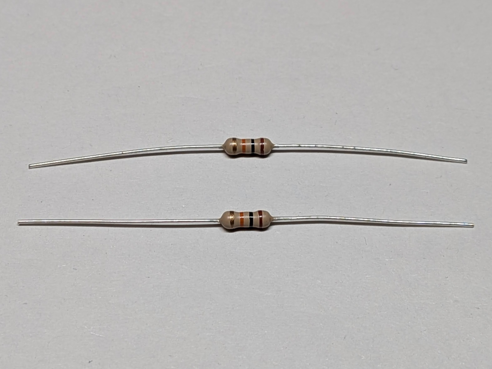
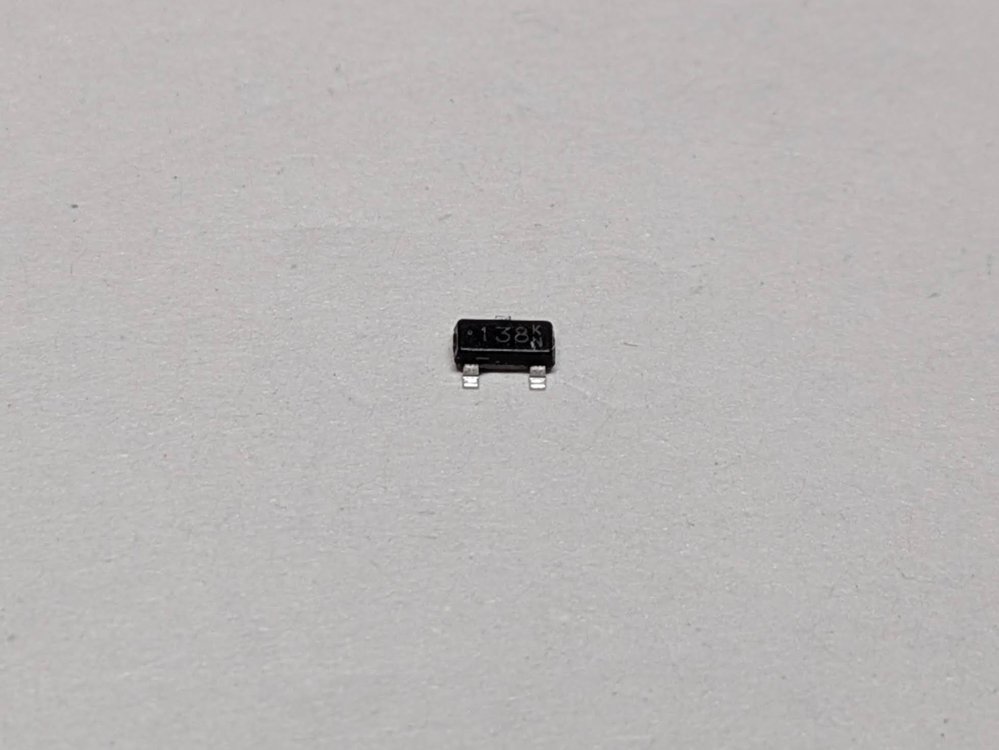

# Whale36ball　ビルドガイド

## 同梱品まとめ
|パーツ名|個数|素材など|
|:---|---:|:---|
|PCB基板|1|FR-4|
|スイッチプレート|1|FR-4|
|ボトムプレート|1|FR-4|
|トッププレート|1|アクリル(マットブラック色)|
|ミドルプレートA|1|アクリル、上側|
|ミドルプレートB|3|アクリル、下側|
|センサー基板スペーサー|1|3Dプリンタ製|
|トラックボールケース|1|3Dプリンタ製|
|センサー用電子ワイヤー|6||
|RP2040-Core-A|1|(以下マイコンと呼称)|
|USB Type-Cコネクタ DIP化基板|1|(以下USB基板と呼称)|
|MOSFET 50V300mA BSS138|1||
|抵抗器 1/4W10kΩ|2||
|ピンヘッダ|1セット||
|ゴム足|6||
|ポロンシート|適量||

## その他必要なパーツ

|パーツ名|個数|備考|
|:---|---:|:---|
|MXスイッチ用Kailh PCBソケット|37||
|1N4148 ダイオード(SMDタイプ)|37||
|LED SK6812MINI-E|34|なくてもキーボードは動作します|
|M2ネジ　3mm|11|※|
|M2ネジ　3mm|4|※|
|M2ネジ　5mm|9|※|
|M2ナット|2|3mm程度のスペーサーでも代用可|
|M2スペーサー　3mm|4||
|M2スペーサー　12mm|7||
|CherryMX互換キースイッチ|37||
|CherryMX互換キーキャップ|37||
|25mm径トラックボール|1||
|PMW3610ブレイクアウト基板（PMW3610+レンズつき）|1||

※ 遊舎工房で取り扱っている「スリムヘッド小ねじ」が、頭部分が薄くて仕上がりが良いのでおすすめです。

- PCB基板

- スイッチプレート

- ボトムプレート

- アクリルプレート・トップ

- アクリルプレート・ミドルA

- アクリルプレート・ミドルB

- RP2040-Core-A

- USB Type-Cコネクタ DIP化基板

- 抵抗器

- MOSFET

- ピンヘッダ 1セット(写真のほかに、USB基板付属の4ピンのもの1セット)

- ゴム足　6個|

# 作製手順

完成形(PCB基板裏面。ボトムプレートを外したところ)

## 最初に
以下、PCB基板の「Whale36」の表記のある側を「裏面」、反対側を「表面」と呼称します。

## 基板のフチの色塗り

ボトムプレートの「ふち」は、切断面が白っぽく、見映えがあまり良くないので黒のマーカーで塗ることをおすすめします。

PCB基板、スイッチプレートはアクリルケースの中に入って見えないので、塗る必要はないです。

## マイコンのはんだ付け
PCB基板にマイコンをはんだ付けします。コンスルーなどは使用せず、基板に直付けとなります。

### 短辺のはんだ付け
マイコンは、ピンヘッダを使ってはんだ付けします。ピンヘッダは7ピンのもの1つ、6ピンのもの2つ、2ピンのもの1つを使いますので、長い物は適当にカットして下さい。

基板の裏面を上に向けて置きます。

マイコンのBOOTスイッチのある面を上にして、短いほうの2辺に、ピン数6のピンヘッダを、ピンの「長い側」から差し込み、マスキングテープなどで基板に仮止めします。

ピンヘッダを差し込むピンは、GNDから29番までの6つ(上図の短辺1)と、6番から11番までの6つ(上図の短辺2)です。

基板を返して表面を上に向け、9番ピンを除く全てのピンをはんだ付けします(9番はハンダ付けしません)。

はんだ付け前あるいははんだ付け後に、ピンの頭をニッパでカットします。

※ このとき、ニッパがマイコン上の部品に触れて壊すことのないよう、十分気をつけて下さい。BOOTボタンはとくに脆いと思いますので注意して下さい。

次に基板を裏返します(裏面)。ピンに付いている、プラスチックのパーツを、マイコン上の部品に触れないよう気をつけながら引き抜きます(このパーツを取り除かないと、マイコンの高さが高すぎて、組立時にボトムプレートと干渉します)。あるいは、引き抜かなくても、隙間にニッパを入れてピンを切れるようでしたら、先に切ってしまっても差し支えないと思います。くれぐれもマイコン上のパーツを壊さないよう注意して下さい。

ピンをはんだ付けし、余ったピンの頭をカットします(先にカットしてからはんだ付けでも大丈夫です)。

### 長辺のはんだ付け

今度は基板の裏面から、長いほうの2辺のうち、12,13,14,15,26,27,28のピン(上図の長辺1)にピン数7のピンヘッダを、また0,1のピン(上図の長辺2)にピン数2のピンヘッダ(6ピンのものを切り取って使います)を差し込み、マスキングテープなどで基板に仮止めします。

基板を返して表面を上に向け、ピンをはんだ付けします(2,3,4,5番のピンはハンダ付けしません)。

あとは短辺のときと同様に、基板の裏面から、ピンヘッダのプラスティックの部品を外し、この面もはんだ付けし、余ったピンの頭をカットします。

## USB基板のはんだ付け
(USB基板の上下に、面付けされていた際のミシン目のバリが残っています。そのまま使用しても動作に影響はありませんが、見た目が気になる方は、ヤスリなどで整えてお使い下さい。)

USB基板は、2ピンのピンヘッダ2個を使って、マイコンと同じように、基板にはんだ付けします。

仮止め後、表面からハンダ付けし、裏返してピンヘッダのプラスチック部品を取り外し、はんだ付けします。ピンヘッダの頭はなるべく低くなるようカットします。

※ PCB基板上の「V D- D+ G」の表記と、USB基板上の同様の文字の向きが一致するように配置します。USB端子の載っている面が表側(上側)になります。

## ファームウェアの書き込み
PCと接続して、ファームウェアを書き込みし、動作の確認をします。

[このページ](firmware/readme.md)からファームウェアをダウンロードします(.uf2ファイル)。

マイコン上のBOOTボタンを押しながら、USB-C端子でPCと接続すると、キーボードがドライブとして認識されます。このドライブのルートフォルダに、ダウンロードしたファイルをドラッグ&ドロップすると、書き込みが行われ、自動的にキーボードのマイコンが再起動され、今度はキーボードとして認識されます。

もし、PCに接続しても認識がされない場合、はんだ付けが正しくされていないピンがあるかもしれません。全てのピンがピンヘッダを通じて基板にはんだ付けされていることを確認して下さい。  

この段階ではまだ文字入力は行えません。キーボードが認識され、ファームウェアの書き込みができれば十分です。詳細には、Vialアプリを起動またはVialのウェブサイトを開いて、正しくキーボードが認識されているのを確かめることもできます。

マイコンの挙動が確認できましたので、次のステップに進んで下さい。

## ダイオードのはんだ付け
ダイオード36個をはんだ付けします。ダイオードは取付向きがあるので注意して下さい。基板上のフットプリントの「短い線」と、ダイオード部品に書かれた縦線のある側を合わせるようにはんだ付けします。

## LEDおよび抵抗器、MOSFETのはんだ付け(LEDを点灯させる場合)
LED SK6812MINI-E 36個をはんだ付けします。はんだ付けについて詳細はここでは説明しませんので、他サイトなどを参考にしてください。

LEDを点灯させるには5Vの電源が必要ですが、RP2040の出力電圧は3.3Vです。そのため、このキーボードではレベルシフト回路を内蔵しています。

以下の図の箇所(基板表側)に、抵抗器とMOSFETをはんだ付けします。MOSFETは刻印されている面を上向きにして取り付けます。

ただし非推奨ですが、この回路を組まなくても3.3Vのままの電源を入力すれば、LEDが点灯するようです(非公式に確認済み)。その場合、抵抗器とMOSFETの取り付けの代わりに、該当箇所を短絡して、3.3V電源が直接LEDに入力するようにします(詳細略)。

## スイッチソケットのはんだ付け
スイッチソケット36個をはんだ付けします。

## 入力動作の確認
キースイッチを取り付ける前に、すべての部品が正しくはんだ付けされているかを確認するために、Vialを起動して、MatrixTesterをクリックし、下部のボタン'unlock'を押します。アンロックするためには、左上の2つのボタンを同時に押す必要があるので、この二つのスイッチだけ基板のソケットに差し込みんで、ロックが解除になるまでボタンを同時押しします。

基板の裏側から各ソケットの2つの端子をピンセットなどで短絡すると、キーを押下したことになります。全てのキーを順番に短絡していって、MatrixTesterの全てのキーを反転させることが出来たら、テストは成功です。

## キースイッチの仮取り付け
四隅のキースイッチをまずは仮組みのために取り付けます。スイッチプレート四隅のスイッチ穴にキースイッチを差し、PCB基板にスイッチを差し込みます。これでスイッチプレートと基板が固定されました。

## ポロン・ガスケットの貼り付け

スイッチプレートの縁にあたる図の場所(赤枠)に、ポロンシートを適当な幅に切って両面テープ(御自分でご用意ください。ニチバン 両面テープ ナイスタック (しっかり貼れてはがしやすい) など)で貼り付けます。ポロンシートはスイッチプレートの両面に貼って、
上下をトッププレートと、ミドルプレートBに挟まれるように配置します。使用するポロンシートの分量(長さ)によって、ガスケットの効果の強弱が変わります。
お好みの硬さになるように分量を調節してください。

## プレートの組み立て ～ 最終仕上げまで
トッププレートとボトムプレートには、7箇所のネジ穴があります。

ボトムプレートの裏側(キーボード名の書かれた面)からM2ネジ(3mm長)を差し込んで、7個のM2スペーサーを固定します。

ボトムプレート上のスペーサーを、3枚のミドルプレートBのスペーサー穴に通します。

ミドルプレートBの上に重なるように、ミドルプレートAを通します。

ポロンシートを貼り付けたスイッチプレート(とPCB基板が一体のもの)を、ミドルプレートBの縁に載せるように配置します。

トッププレートを載せて、スペーサーにM2ネジ(5mm長)で固定します。

スイッチプレートに前後左右する多少の余裕があると思いますので、(キーキャップ取り付け後に)前後左右させて、
キーとトッププレートが干渉しないように調整します。

残っているスイッチをスイッチプレート・PCB基板に差し込みます。

ボトムプレートの四隅および最下部付近に、6個のゴム足を貼り付けます(キーを押したときにガタツキがないように貼ってください)。

これで完成です。作業お疲れ様でした。

ひき続き、使用前に同時押しで入力する機能を設定することをおすすめします。以下におすすめの設定を紹介しています。

[Comboのおすすめの設定](keymap.md)

## (オプション)PCB基板へポロンシートを貼り付ける
PCB基板とボトムプレートに、ポロンシートなどを貼り付けることで、アクリルケース内でのスイッチの反響音の低減と、打鍵感をよりソフトにする効果が得られます。

一旦PCB基板からスイッチを取り外し、表側(キースイッチを挿し込む側)に、市販の静音フォームなど(たとえば「Kelownaプレート用静音フォーム」: Talpkeyboardさんで購入可)を貼り付けます。

また、ボトムプレート内側に、ポロンシートやフェルト生地などを、適当なサイズに切り、(スイッチを押した際に干渉しないよう注意して)貼り付けます(私の利用しているものは、1mm厚のフェルト生地です)。
